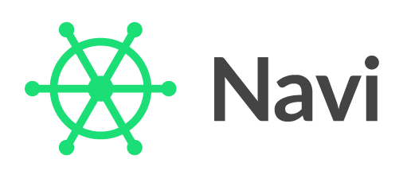

**A router/loader for React**

Navi is a new kind of router: as your app's URL changes, it starts fetching the new URL's content, and then it *waits*. It then renders the page *once the content has loaded*.

Delayed rendering makes routing simpler. Instead of manually managing component state and loading spinners, you just assign URLs to content using `async`/`await` and `import()`. Navi does the rest -- it fetches your content, manages your page's `<title>` and scroll position, and even warns you about broken links!

- aside: not familiar with async/await/import? Take the course on Frontend Armory!

What's more, Navi includes a tool to statically render your site, giving you control over meta tags and dramatically improving page load speed. *And all without even ejecting from create-react-app!*


The minimal example
-------------------

After spinning up a fresh app with [create-react-app](https://github.com/facebook/create-react-app), start by installing the Navi packages:

```bash
npm install navi react-navi --save
```

Once you've installed the `navi` and `react-navi` packages, you can create your first Navi app in just three steps.

### 1. Declare some pages

To declare your pages, you'll use Navi's `createSwitch()` and `createPage()` functions. Switches are used to map paths to pages. Pages represent individual locations that you can navigate to.

```js
// switches/index.js
import { createPage, createSwitch } from 'navi'
import * as React from 'react'
import { Link } from 'react-navi'

export const rootSwitch = createSwitch({
  paths: {
    '/': createPage({
      title: "Navi",
      getContent: () =>
        <div>
          <h2>Navi</h2>
          <p>A router/loader for React</p>
          <nav><Link href='/reference'>API Reference</Link></nav>
        </div>
    }),

    '/reference': createPage({
      title: "API Reference",
      getContent: async () => {
        let { Reference } = await import('./reference.js')
        return <Reference />
      }
    }),
  }
})
```

As you'll see later, you can return *anything* from `getContent()`. You can return markdown, JSON, or even arbitrary functions! But `react-navi` has special support for React elements, so let's start by defining the content that way.

But what about the `/reference` page? It's not returning an element. It's returning a *Promise* to an element -- and this is where Navi shines. When the user clicks the "API reference" link, instead of immediately rendering a blank page, Navi will wait until `reference.js` has loaded ---  and *then* it'll render the page.

```js
// switches/reference.js
import * as React from 'react'
import { Link } from 'react-navi'

export const Reference = () => (
  <div>
    <h2>Reference</h2>
    <p>Coming soon.</p>
  </div>
)
```

### 2. Create a `Navigation` object

Navi does all of the hard work within a `Navigation` object. This is where Navi watches for history events, matches URLs to pages and content, and turns all this info into an object that you can use.

To create a `Navigation`, just call `createBrowserNavigation()` within `index.js`, passing in the `rootSwitch` object that you defined earlier.

```js
// index.js
import * as React from 'react'
import * as ReactDOM from 'react-dom'
import { createBrowserNavigation } from 'navi'
import { rootSwitch } from './switches'
import App from './App'

let navigation = createBrowserNavigation({ rootSwitch })

ReactDOM.render(
  <App navigation={navigation} />,
  document.getElementById('root')
);
```


### 3. Render the content within `<App>`

The `navigation` object that you just passed to `<App>` contains all of the information that you need to render your app. And while you *could* consume all of that information yourself, it's far simpler to just use Navi's built in components.

To start out, you'll only need two components: `<Navi.Provider>`, and `<Navi.ConsumeContentSegment>`. You'll want to wrap `<Navi.Provider>` around your entire App, and then place `<Navi.ConsumeContentSegment>` wherever the content should go.

```js
// App.js
import * as React from 'react'
import * as Navi from 'react-navi'
import './App.css'

class App extends Component {
  render() {
    return (
      <Navi.Provider navigation={this.props.navigation}>
        <div className="App">
          <header className="App-header">
            <h1 className="App-title">
              <Navi.Link href='/'>Navi</Navi.Link>
            </h1>
          </header>
          <Navi.ConsumeContentSegment />
        </div>
      </Navi.Provider>
    );
  }
}

export default App;
```

And that's it --- you've built a working app with asynchronous routes! Of course, this tiny app is just an example, but Navi handles real-world apps with ease. In fact, **Frontend Armory is built with Navi**.

In fact, let's add a couple real-world tweaks as a bonus step, just to see how easy it can be.


### Loading indicators

As Navi doesn't render the new page until it has loaded, there can sometimes be a large delay between clicking a link seeing the result. In cases like this, it's important to keep the user in the loop. And to do so, you can wrap your app with a `<Navi.Consume>` component:

```js
class App extends Component {
  render() {
    return (
      <Navi.Provider navigation={this.props.navigation}>
        <Navi.ConsumeSegment waitingIndicatorDelay={333}>
          {({ showWaitingIndicator }) =>
            <div className="App">
              {
                showWaitingIndicator &&
                <div className="App-loading-bar" />
              }
              <header className="App-header">
                <h1 className="App-title">
                  <Navi.Link href='/'>Navi</Navi.Link>
                </h1>
              </header>
              <Navi.ConsumeContentSegment />
            </div>
          }
        </Navi.ConsumeSegment>
      </Navi.Provider>
    );
  }
}
```

This component accepts a render function as its children, and passes in a `showWaitingIndicator` property. If the next page takes more than the specified interval to load, `showWaitingIndicator` becomes true. You can use this to show a loading bar or some other indicator.

But what exactly is `<Navi.Consume>`? And for that matter, what is `<Navi.ConsumeContent>`?

- Rembember when you defined your pages and switch?
- Navi builds a list of `segment` object from the items in this tree that match the current URL
- You can check the current segments via the `this.props.navigation` object.
- `Consume` takes the next available segment from this tree -- in this case, it takes the root switch.
- `ConsumeContent` takes the next segment that has content -- in this case, it takes the page
- It then renders the content -- or if you pass in a function, it lets the function render the content for you.
- For example, you could pass in a child function to the inner <ConsumeContent>, and render the content yourself.

### Handling 404s

- Show how to handle them

```js
class App extends Component {
  render() {
    return (
      <Navi.Provider navigation={navigation}>
        <Navi.ConsumeSegment waitingIndicatorDelay={333}>
          {({ showWaitingIndicator }) =>
            <div className="App">
              {
                showWaitingIndicator &&
                <div className="App-loading-bar" />
              }
              <header className="App-header">
                <h1 className="App-title">
                  <Navi.Link href='/'>Navi</Navi.Link>
                </h1>
              </header>
              <Navi.NotFoundBoundary render={renderNotFound}>
                <Navi.ConsumeContentSegment />
              </Navi.NotFoundBoundary>
            </div>
          }
        </Navi.ConsumeSegment>
      </Navi.Provider>
    );
  }
}

function renderNotFound() {
  return (
    <div className='App-error'>
      <h1>404 - Not Found</h1>
    </div>
  )
} 
```

- Explain how handling 404s as errors means that 404s in nested routes will bubble up to the handler. You can also add nested boundaries to handle 404s differently in nested routes.
- NotFoundBoundary catches `Navi.NotFoundError`. You can also throw this yourself. For example, you might throw it from within getContent() when passing an id via URL parameters that can't be found.
  (use plan as an example)

### Examples and API Reference

- Navi is part of the Frontend Armory Toolbox. You can find an API Reference and a more examples there, including:

  * params
  * redirects
  * nested routes (pro)
  * static rendering (pro)

- Will be adding one example a week. Some examples are exlusive to pro members at first - join in to get access and support development!
- To get the most out of Navi, you'll need a solid understanding of Promises, async/await, and import. Need a hand to get there? Take the course on frontend armory!
- Sign up to the weekly newsletter to get notified of each new example as they're released.


License
-------

Navi is MIT licensed.
