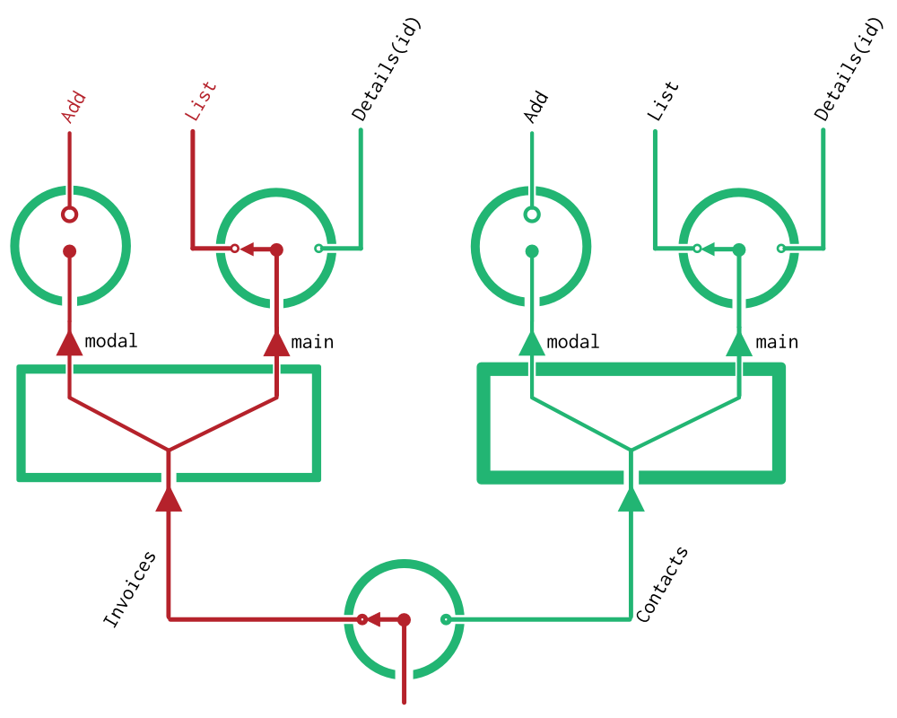

# Junctions

So far, you've learned about the two types of objects which hold the location state of your application:

- `Location` objects, which store state in the format of the Browser's API
- `RouteSet` objects, which store state in the format of your Component tree

Junctions are another type of Object. But in contrast to the first two objects, Junctions don't actually hold any state. Instead, each Junction corresonds to a single part of a `Location`, and specifies how to *just that part* of a Location to a `Route`. How do they do this?

**`Junction` objects contain the information used to map a *given part* of a `Location` to a `Route`, and vice versa.**

In a way, `Junction` objects are just like the junctions in a railway system. They're points at which a route can take one of many branches. Each junction can feed into the next junction to create a tree. And the Route you take through them all will depend on your final Location.

So now that we have an idea of what a Junction is, let's go back to take a second look at a Route from the [Routes](Routes.md) page:

```js
{
  // PaymentList is a `Branch` object!
  branch: PaymentList,
  
  data: { ... },
  params: { ... },
  children: { ... },
}
```

You might now guess that the `branch` property of each Route corresponds to one of these types which a `Junction` object defines. And you'd be right! Each of these `Branch` objects store the information about *one* type of route -- including its URL pattern, any available parameters, and that arbitary `data` object which you also see above.

The next guess you might make is that since the available branches for a `Route` object can be defined by a `Junction`, it might also make sense to have a `JunctionSet` which maps to a `RouteSet`. And you'd be right again!

And just as a `Route` object stores its children with a `RouteSet`, we'd expect that a single branch of a `Junction` will define its possible child routes with a `JunctionSet`.

But honestly, explanations of tree structures like this just don't map very well to paragraphs. It is all a lot easier to grok if you just draw it. So that's what we'll do.

## Junction Diagrams

A junction diagram is kind of like a schematic for your application. It represents all of the possible routes your application can take, using the following conventions:

1. Junctions are represented as rotary switches, with the default branch drawn as the currently selected arm of the switch.
2. Junction Sets are represented as splitters
3. Routes can be drawn onto the diagram by lighting up one path through a series of junctions

Here's an example. In fact, its pretty close to what you saw in the [Routes](Routes.md) page -- the main difference is that it now shows default branches.



Junction diagrams are a great tool to reason about an application's structure. In fact, if we were to also write out the options for each Branch, these diagrams would contain enough information to perform a mapping between Locations and RouteSets. But as great as diagrams may be for humans, they're not very useful for machines. So to represent our Junctions within an actual application, we'll need to declare our junctions as objects.

