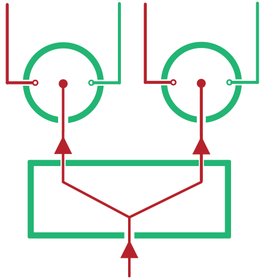

# Routes

Routes are objects which contain instructions on which parts of the applicaiton to display. In a way, they're a lot like [Locations](Location.md). In fact, both Location objects and Route objects store *exactly the same information*. The difference is in how this information is structured.

**`Route` objects have a structure which mirrors your component hierarchy. `Location` objects have a structure which mirrors your browser's History and URL API.**

If this feels a little like word soup, it might help to consider what the words "Route" and "Location" mean in plain English. While a "Location" is like a point on a map, a "Route" contains the information on how to actually get there. So where a `Location` holds an **absolute location** within your app, a `Route` holds a **tree of decisions** on which branch to follow at a given point. Which you can visualize as a path through a number of switches:


<div style="text-align: center; font-size: 85%; font-style: italic;">A `Route` can be represented as a line through a number of switches, while a `Location` would be represented as the state of a single switch.</div><br />

So what does a `Route` object look like in practice? Here's a really simple one:

```js
{
  // The type of child to render for this component
  branch: PaymentList,

  // An object which holds aribtrary data, based on the current branch
  data: { ... },

  // Any extra information you need to render that child
  params: {
    order: 'date',
    where: { paid: false },
  },

  children: null,
}
```

This Route represents the right hand side of the URL in the example `Location` from the [Locations](Locations.md) section. Visually, you could imagine it as a single active joint betewen two switches. The `params` here come from the location's `search` property, while the `branch` is taken from the `pathname`. You'll see where `PaymentList` comes from in a moment, but for now all you need to know is that it represents one of a set of patterns within a certain slice of the URL.

Ok, so this gives us the right hand side of the URL. How do we represent the left hand side?

```js
{
  branch: Contacts,
  data: { ... },
  params: {
    id: '15',
  },
  children: /* ... */,
}
```

Looks pretty much the same as the first `Route`, right? The difference is that this Route has a non-null value for `children`. Actually -- the first route is *included* in the `children` of second route. And that means that this represents a path through a number of switches.


Ok, so now we've converted the URL from this `Location`:

```js
// Location
{
  pathname: '/contact/15/payments',
  search: '?order=date&where=paid:false'
  state: {
    $$junctions: {
      'main': { branchKey: 'AddContactModal' },
    }
  }
}
```

But the `Location` still has some information in its `state` property -- how do we deal with this?

It turns out that we don't yet know enough to say exactly how that state will convert to a `Route`, but let's make a guess. Given the `state` object has a key of `AddContactModal`, we can assume that it means there'll be a child `Route` within the `Contacts` branch which indicates that a modal is open. And this presents a problem. How can we have two child Routes active at one time?

## Route Sets

A `RouteSet` is an object which can represent *multiple* active routes. If we think about it in terms of the above diagram, this means that in addition to being able to represent a single active line, it also represent a *split* in a line -- allowing multiple children to be active simultaneously.



So where are route sets used? In every `Route` object's `children`! This ensures that any `Route` can represent state stored in a URL *as well as* state stored in HTML5 history state. For example, the current page's active tab, as well as an active modal.

This is an important difference between Junctions and URL-based routers, so it is worth spending a moment to really get your head around how this works.

The thing about URLs is that they're like a list of instructions -- "take this branch, then take that branch, then take that branch". This means that you represent a URL as a list of routes *with no splits*. Just like that first route diagram:


<div style="text-align: center; font-size: 85%; font-style: italic;">URLs cannot represent multiple active routes.</div><br />

But by using `state`, we're no longer limited in this way. We can now take multiple paths at once, and render mutiple child components with their own routes from within a single component. Or in other words, we can have **superimposed** routes.

## Example

Now that you know about Routes and Route Sets, let's have a look at a complete pair of `Location` and `Route`:

```js
// Route
{
  branch: Contacts,
  data: { ... },
  params: {
    id: '15',
  },

  // A `RouteSet` is just an object mapping string keys to `Route` values
  children: {
    // The `main` Route always corresponds to the URL part of the `Location`
    main: {
      branch: PaymentList,
      data: { ... },
      params: {
        order: 'date',
        where: { paid: false },
      },
    },

    // Other Routes correspond to the `state` part of the `Location`
    modal: {
      branch: AddContactModal,
      data: { ... },
    },
  },
}
```

## Next Steps

You should now have a basic grasp of what a Route actually is. But what is that `data` property? And what about the `Contacts`, `PaymentList` and `AddContactModal` objects in the above example?

Actually, these objects are something that we need to declare. They're how we teach Junctions how to map between Locations and Route Sets. And they're part of what gives this package its name.
