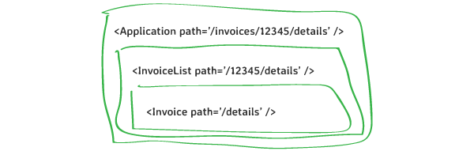
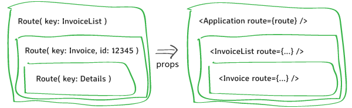
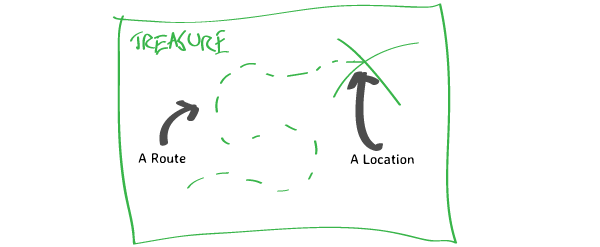
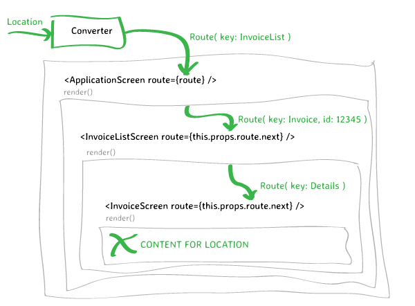
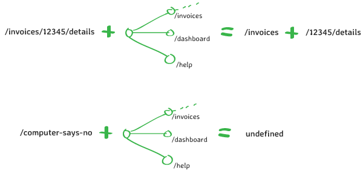
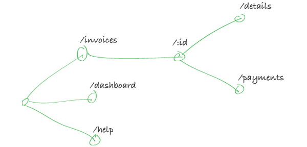

# What Is A Junction?

It's time to talk specifics. What *in particular* is a Junction? And what does it give you that you don't get from a hand-rolled router?

Junctions are what allow you to find a `Route` for some given `Location`. But this brings up another question: *what exactly is a `Route`?* And how do Junctions allow us to find them?

The short answer is that:

1. A `Route` is a structure that represents routing information
2. A `Converter` converts URLs into `Route` objects
3. A `Junction` structure provides the configuration for the `Converter`

But that was all pretty hand wavy, so let's dive into the details.

## Routes Ain't Locations

The best way to understand a `Route` object is to compare it to the `Location` objects that we first encountered in [Do I Need A Router?](do-i-need-a-router). Recall that [Location](/api/junctions/Location) objects each hold a single URL and some arbitrary state:

```js
{
  pathname: '/invoices/12345/payments',
  search: '?page=2',
  state: {
    arbitrary: 'stuff',
  }
}
```

The problem that we encountered with `Location` objects is that their structure doesn't fit with React; while Locations are flat, Components are trees. Splitting up the information in a `Location` object and passing it to the correct component is cumbersome and repetitive.



<center><small><strong>Getting flat Location data into a nested component tree is a PITA.</strong></small></center>

Routes, like Locations, are a way of representing navigation state. But unlike Locations, `Route` objects are structured to match your component tree *perfectly*. Routes can be nested and composed, just like React components. And most importantly, they're relative. They only contain the state relevant to one component -- not the entire application.



<center><small><strong>Nested route data flows naturally through a component tree.</strong></small></center>

But how do we get `Route` objects? The browser API only understands absolute `Location` objects, so we're going to need some way of converting between `Location` and `Route`. And that's what the `Converter` is for.

## Converters Convert

Converters do exactly what you would expect them to do. That is, they convert between `Route` and `Location` objects. The question is -- *how?*

The problem is that the information within a `Location` object isn't sufficient to find a `Route`. To demonstrate, consider the URL `/invoices/add`. Should the converter create a single-level route, or two nested routes? And does this URL represent an "Add Invoice" screen, or an Invoice with the id "add"?

```js
// A single-level route for an Add Invoice page
const option1 = {
    key: 'AddInvoice'
}

// A nested route for an Add Invoice page
const option2 = {
    key: 'InvoiceList',
    next: {
        key: 'Add'
    }
}

// A nested route for an invoice named "Add"
const option3 = {
    key: 'InvoiceList',
    next: {
        key: 'Invoice',
        params: { id: 'add' }
    }
}
```

To find out how to distinguish between these cases, let's take a little detour and consider what the words "location" and "route" actually *mean*.

According to the Oxford Dictionary of English:

- A location is "a particular place or position"
- A route is "a way or course taken in getting from a starting point to a destination"

Or to put this into pixels:



You can think of a `Converter` as a pathfinder; something that finds a `Route` given a `Location`. Or more specifically, it uses the information within a `Location` to build a `Route` object that specifies a path through your component tree.


<center><small><strong>The information in a Route the path to take through your component tree.</strong></small></center>

But how would a pathfinder find a route to a location? It would need to know all of the possible actions at any possible point. Or to put it simply, it would need a map! And as you may have guessed, in the Junctions world, these maps take the form of `Junction` objects.

## Junctions Are Maps

A `Junction`, like a map, is an object that specifies *possible locations*. More specifically, it defines all of the possible paths which are valid ways for a URL to begin.

Junctions are simple to create, so the best way to demonstrate this is with a demonstration:

```js
// This Junction indicates that a URL may start with either of
// two strings
const junction = createJunction({
    Dashboard: {
        path: '/dashboard',
    },
    InvoiceList: {
        path: '/invoices',
    },
})
```

Implicit in a junction is another piece of information: any path that is *not* specified is not possible. This fact is useful for the Converter.

If a URL that is passed to the Converter begins with a string specified in a `path`, it can slice off the `path` and use it to form a  `Route` object. But if no corresponding `path` exists, we've got a 404.



Junction objects, just like `Route` objects, are *relative*. There is nothing in a Junction which ties it to the root of your application. Its `path` properties can be used to denote the possible ways of starting *any* string -- including an arbitrary slice of a URL.

So assuming the Converter matches the beginning of a URL with a `path`, what does it do with the remainder? It passes whats left through whatever `next` Junction you've specified.

```js
const junction = createJunction({
    Dashboard: {
        path: '/dashboard',
    },
    InvoiceList: {
        path: '/invoices',
        next: createJunction({
            Invoice: {
                // You can define a named wildcard within your path
                // with `:` -- just make sure you configure it by
                // adding it to a `paramTypes` object!
                path: '/:id',
                paramTypes: {
                    id: { required: true },
                }
            },
        }),
    },
})
```

Junctions aren't named Junctions for nothing. And as it turns out, you can visualise them as maps -- of Junctions.



But while this certainly is a map of Junctions, there is another word for a diagram like this: a [Decision Tree](https://en.wikipedia.org/wiki/Decision_tree). **Any `Junction` can be represented as a decision tree.**

And when you think about a `Junction` graphically, everything becomes a little easier to understand:

- Each node on the diagram is one possible `Location`
- Any `Location` without a node on the graph is a 404
- And once you have a `Location`, you can follow the map from right to left to find the `Route`

Of course, if *you* can find the correct `Route` using a map like this, the `Converter` can too!


