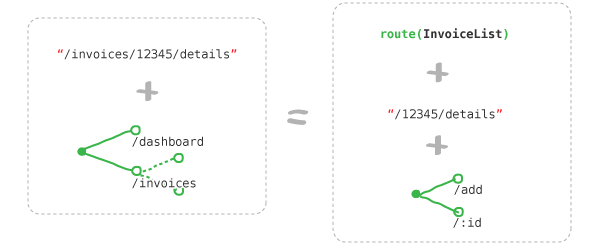
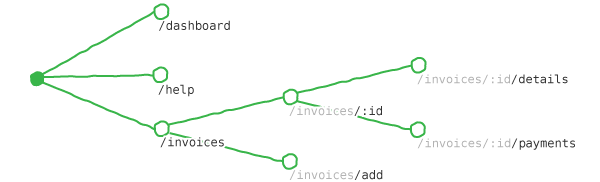

# What You Get From Junctions

So far, we've covered what you get from Junctions in a rather general sense:

- You get the ability to compose components that have routes
- You get integration with HTML5 History
- You get flexibility to use React however you'd like

But what is it about Junctions that makes all of this possible? To answer this, we're going to need to dive into the specifics. So let's change the question a little:

*What tools in particular will make your life easier?*

This is easier to answer.

1. A `Route` structure that represents routing information
2. A `Converter` that converts URLs into `Route` objects
3. A `Junction` structure that allows you to configure your `Converter`

It turns out that these three tools are all you'll need to write a Junctions app, so let's go through them in a little more detail!

## Routes Ain't Locations

The best way to understand a `Route` object is to compare it to the `Location` objects that we first encountered in [Do I Need A Router?](do-i-need-a-router.md). Recall that [Location](/docs/api/junctions/Location.md) objects each hold a single URL and some arbitrary state:

```js
{
  pathname: '/invoices/12345/payments',
  search: '?page=2',
  state: {
    arbitrary: 'stuff',
  }
}
```

The problem that we encountered with `Location` objects is that their structure doesn't fit with React component trees. Splitting up the `pathname` and getting the information to the correct component is cumbersome.


*It is not immediately obvious how to pass a flat Location into a nested tree.*

And even if you're fine with splitting up this information manually, you'll still face the problem of composability. As the [Haiku of Routing Principles](three-principles.md) states, *Components Compose* -- but URLs don't.

This is where Routes come in. Routes, like Locations, are a way of representing navigation state. But unlike Locations, `Route` objects are composable, and structured to match your component tree *perfectly*.


*Nested route data flows naturally through a component tree.*

Each `Route` object has:

- a `key` specifying the type of route that it represents
- some `params` that have been extracted from the URL's path or query string
- one or many `next` routes, allowing routes to be composed just like components

For example, the Route in the diagram above would look something like this:

```js
{
    key: 'InvoiceList',
    next: {
        key: 'Invoice',
        params: { id: 12345 },
        next: {
            key: 'Details',
        },
    },
}
```

But how do you get hold of a `Route` object? The browser API only understands absolute `Location` objects, so we're going to need some way of converting between `Location` and `Route`. And that's what the `Converter` is for.

## Converters Convert

Converters convert between `Route` and `Location` objects, just as you might expect. But a `Location` object by itself doesn't have enough information to generate a `Route` object -- *so how does the Converter actually work?*

To demonstrate, let's consider the URL `/invoices/add`. To create a `Route`, the Converter will need to choose between a number of possibilities:

-   Does `add` represent a page with a form for adding new invoices, or an Invoice with the ID `"add"`?

    ```js
    const option1 = {
        key: 'AddInvoice',
    }
    
    const option2 = {
        key: 'Invoice',
        params: { id: 'add' },
    }
    ```

-   Should this URL be represented as a single Route, or as two nested routes?
    
    ```js
    const option1 = {
        key: 'AddInvoice',
    }
    
    const option2 = {
        key: 'Invoices',
        next: {
            key: 'Add',
        },
    }
    ```

As you can see, there is a problem: *The Converter doesn't know how to answer these questions.*

We're going to have to *tell* it the answers. And that is what `Junction` objects are for!

## Junctions List Possibilities

A `Junction` is an object which defines the *possibilities* that a `Converter` needs to consider.

The best way to understand this is to see it in action. So let's create a `Junction` which can answer the questions from the previous section:

```js
const junction = createJunction({
    Dashboard: {
        path: '/dashboard',
    },
    InvoiceList: {
        path: '/invoices',
    },
})
```

If we pass this `Junction` to a `Converter`, **we're indicating that the `Converter` only needs to consider two possible URLs**. Anything else is unexpected, and the `Converter` is perfectly within its rights to bail by returning `undefined` -- i.e. 404.

So now that we have a `Junction`, let's answer the questions from the previous section:

> **Q**: Does `add` represent a page with a form for adding new invoices, or an Invoice with the ID `"add"`?<br />
> ***A**: It represents neither!*

> **Q**: Should this URL be represented as a single Route, or as two nested routes?<br />
> ***A**: It is `undefined`!*

We probably don't actually want the `Converter` to return `undefined`, so let's fix the `Junction`. But how?

Junction objects, like `Route` objects, can be nested using the `next` property. And importantly, the possible paths they specify are *relative* -- not absolute.

```js
const junction = createJunction({
    Dashboard: {
        path: '/dashboard',
    },
    InvoiceList: {
        path: '/invoices',
        next: createJunction({
            Invoice: {
                path: '/:id',
                paramTypes: {
                    id: { required: true },
                }
            },
        }),
    },
})
```

By specifying a `next` junction, you're telling the `Converter`:

*If you find a URL which begins with this `path`, the **next** part of the path should match the **next** Junction*.

You can even think of this as a kind of equation:



If the URL starts with one of your branches, you get a `Route`, the next `Junction`, and the remainder of the URL. Repeat the process until you either have no remainder URL, no next `Junction`, or no matching branch. That's all the `Converter` does! *It's Math, not Magic.*

Speaking of math, when you draw all of your junctions as a tree, you get a pretty thing like this:


*Junctions can be represented as a Decision Tree*

The great thing about this *Junction Diagram* is that you can see at a glance what Route any given URL will take. You could even draw it:


*Routes can be represented as a subset of a Decision Tree.*

And with that, you know that Junctions are exactly what the `Converter` needs to find a `Route`. After all -- they're exactly what you need, too!


