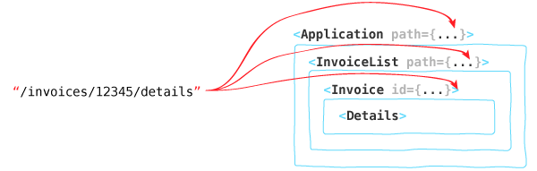

# Tutorial

This guide will walk you through putting together a small React app from scratch using Junctions and [create-react-app](https://github.com/facebookincubator/create-react-app).

It is assumed you're already reasonably familiar with React. If you're not, start by reading [Learn Raw React](http://jamesknelson.com/learn-raw-react-no-jsx-flux-es6-webpack/).

The result of this guide is [available on GitHub](https://github.com/jamesknelson/junctions-react-app).

## Creating your project

Before getting started, you'll need to install `create-react-app` if you haven't already:

```bash
npm install -g create-react-app
```

Once `create-react-app` is installed, create a new app and install `junctions`, `react-junctions` and `history`:

```bash
create-react-app junctions-demo
cd junctions-demo
npm install junctions react-junctions --save-dev
npm start
```

Then open <http://localhost:3000/>. You should see a spinning React logo, which means you're ready to get started!

## Adding a menu

All good demo apps have menus, so let's start by adding a simple one using `<a>` tags.

A project generated with `create-react-app` only has one component -- the `App` component in `App.js`. So let's add our menu there by replacing its `render()` method:

```js
  render() {
    return (
      <div>
        <ul>
          <li><a href="/dashboard">Dashboard</a></li>
          <li><a href="/invoices">Invoices</a></li>
        </ul>
      </div>
    )
  }
```

After saving your changes, you should see a very simple menu. You can even click the links and see how the URL changes! This works because the server included with `create-react-app` will redirect any requests to your one `index.html` file. But it's behaviour isn't exactly what we'd like; every click will result in a flash and refresh of the page.

## History and `pushState`

Instead of letting the browser do a standard page load when the user selects a menu item, we'd like to use the [History API](https://developer.mozilla.org/en/docs/Web/API/History)'s `pushState()` method to update the URL *without* reloading the page.

The behaviour of the History API can differ between browsers. You could deal with these differences by yourself, but it is easier to use the wrapper provided by the [history](https://github.com/mjackson/history) package.

You should have installed this earlier, so all that is left is to import `createBrowserHistory` and then to actually create one!

```jsx
import createBrowserHistory from 'history/createBrowserHistory'

const history = createBrowserHistory()

class App extends Component {
    // ...
}
```

## Links

Now that you have access to a `history` object, you'll need to use it to replace the default navigation events with `pushState()` calls.

The idea is to add an `onClick` event handler to each `<a>` element, and to cancel the default action and call `history.push()` instead:

```js
function pushDashboard(e) {
    e.preventDefault()
    history.push('/dashboard')
}

<a href="/dashboard" onClick={pushDashboard}>Dashboard</a>
```

Of course, writing this out for each link would be traumatic. And it wouldn't be very user-friendly, either -- right clicking isn't handled well, `target` props on the `<a>` are not handled well, etc. Luckily, The `react-junctions` package provides a `<Link>` component which handles all of this for you!

The `<Link>` component provided by `react-junctions` takes two parameters:

- `to`: A [Location](./api/junctions/Location.md) object specifying where the Link points top
- `history`: An optional `history` object whose `push()` method should be called

Let's replace the existing `<a>` tags with `<Link>` elements:

```js
<li>
    <Link
        history={history}
        to={{ pathname: "/dashboard" }}>
        Dashboard
    </Link>
</li>
<li>
    <Link
        history={history}
        to={{ pathname: "/invoices" }}>
        Invoices
    </Link>
</li>
```

*Note: the `history` prop is optional, but your links still need access to a `history`! If you don't pass `history` via `props`, you'll need to pass it via `context`, using the `<HistoryContext>` or `<Router>` components. We'll discuss this a little later on.*

After saving your file, you should be able to follow click links without a page refresh. You're making progress! But there is one problem: how do we know that the user has navigated?

## Handling navigation events

Each time a new state is pushed onto your `history` object, it notifies any listeners that you've added. So how do you add a listener? By using `history.listen()`!

Here's an example which prints the new path to the JavaScript console each time you click a link:

```js
history.listen(location => {
    console.log(location.pathname)
})
```

Of course, just printing the location to the console isn't going to help very much. What you *really* want to do is use the location to decide what to render. But this means that the current location will need to be available as component state. And *that* means that you're going to need to call `history.listen()` within a lifecycle method.

The details on lifecycle methods and component state aren't really relevant to this guide, so let's skip them and just say that your `App` component is going to look something like this:

```js
class App extends Component {
    constructor(props) {
        super(props)

        this.state = {
            // The initial location at page load is
            // available at history.location
            location: history.location
        }

        history.listen(this.handleNavigation.bind(this))
    }

    handleNavigation(location) {
        this.setState({ location })
    }

    render() {
        return (
            <div>
                <ul>
                    <li><Link
                        history={history}
                        to={{ pathname: "/dashboard" }}>
                        Dashboard
                    </Link></li>
                    <li><Link
                        history={history}
                        to={{ pathname: "/invoices" }}>
                        Invoices
                    </Link></li>
                </ul>
                <h1>{this.state.location.pathname}</h1>
            </div>
        )
    }
}
```

With this, your new heading element should reflect the current pathname. You've made a router! Congratulations!

## Do I Really Need A Router?

This may seem out of place in a tutorial for a routing library, but it is an important question to ask. *Do I Really Need A Router?*

The thing about routing libraries is that they're only useful when they solve a genuine problem. Otherwise, they're just taking up space.

**The single major problem that a routing library can solve for you is the structural mismatch between URLs and your React component tree.**

If the routing state in your app is only ever used by your top most component -- like in the above example -- then you don't have a problem.

But what if you have nested components which each need to access some part of your routing state? In this case, manually passing navigation state around is clumsy and error-prone.


*It might not be impossible to get the information to the right component, but it certainly won't be any fun.*

Instead, you're going to want a representation of your routing state which better matches the structure of your component tree. And that's where Junctions' `Route` structure comes in.


*Route objects are designed to match the structure of your component tree perfectly.*

## Routes

A `Route` is a data structure which holds information about the user's current Location within the app. In fact, it holds *exactly* the same information as a `Location`. It just uses a different format, which looks a little like this:

```js
{
    // An name used to identify the *type* of route
    key: 'Invoice',

    // Params extracted from the URL and query string
    params: { id: '12345' },

    // A property which can hold a *nested* route
    next: null,
}
```

Returning now to our application, remember that we have a heading which prints the current location by `pathname`:

```js
<h1>{this.state.location.pathname}</h1>
```

But suppose what we'd really like to do is print the `key` of the `Route` that corresponds to our current location:

```js
<h1>{route.key}</h1>
```

The question becomes: *how do we get hold of one of these `Route` objects?*

## Converting `Location` objects to `Route` objects

There is an easy way to do this, and an *even easier* way.

- The easy way involves using a `Converter` object to convert between `Location` and `Route` objects.
- The *even easier* way is to use the `<Router>` component provided by `react-junctions`. And as a bonus, this will set `history` on its context, removing the need to manually pass it to `<Link>` elements rendered inside it.

Actually, the `<Router>` component still uses a `Converter` internally. It just lets you trade away a little flexibility for a whole lot less boilerplate. And since you probably don't need to configure the `Converter` manually, this is a pretty good deal. So let's go with the *even easier* option.

## The `<Router>` Component

`<Router>` is a component provided by the `react-junctions` package that takes three props, but let me tell you about two of them:

- `history` - a history object to `listen()` to
- `render` - a React element (or function returning an element) that will be rendered

The `<Router>` takes care of all of the history-related boilerplate that was added earlier. All that is left to do is give it a `history` object and an element to render.

*But how does the rendered element know what the current route is?*

Each time the current location changes, `<Router>` will calculate a corresponding `Route` and inject it into your `render` element's props as `route`. This might be a bit of a mouthful, but it is pretty simple when you see it in action:

```js
// This component will receive a `route` prop from the `<Router>`
// component. You can add any other props that you'd like to pass
// within the `render()` method of the App Component.
class Root extends Component {
    render() {
        return (
            <div>
                <ul>
                    <li>
                        <Link to={{ pathname: "/dashboard" }}>
                            Dashboard
                        </Link>
                    </li>
                    <li>
                        <Link to={{ pathname: "/invoices" }}>
                            Invoices
                        </Link>
                    </li>
                </ul>
                <h1>{this.props.route.key}</h1>
            </div>
        )
    }
}

class App extends Component {
    render() {
        return (
            <Router
                history={history}
                render={<Root />}
            />
        )
    }
}
```

This makes your app *almost* complete, but there is just one problem. `<Router>` doesn't actually know how to convert `Location` objects into `Route` objects.

Remember that I mentioned that the `<Router>` takes *three* props? The third prop is actually *required*; it is how `<Router>` knows how to convert between locations and routes. So what is this mysterious third prop? It is the `junction` prop, and you need to pass it a `Junction`.

## Junctions

Your `<Router>` uses a `Junction` object to decide how to map `Location` objects to `Route` objects. But instead of trying to explain how that works, let's just create one. Here is how:

```js
// Add this inside your `Root` class definition
static junction = createJunction({
    Dashboard: {
        default: true,
        path: '/dashboard'
    },
    Invoices: {
        path: '/invoices',
    },
})
```

This will add a static `junction` property to your `Root` component. All that is left is to pass it to the `<Router>` element:

```js
render() {
    return (
        <Router
            history={history}
            junction={Root.junction}
            render={<Root />}
        />
    )
}
```

Congratulations! You now have a working application that lets you navigate between pages, and each page will display the route `key` -- i.e. the key of the object passed to `createJunction()` that contains the current `path`.

## Why you need Junctions

A `Junction` is an object which defines the possible locations that a `<Router>` needs to consider. The question is, *why* does a `<Router>` need to know all possible locations?

To answer this, let's go over an example. Imagine you have the following URL:

```
/invoices/add
```

Assuming you don't also have access to a `Junction` object, my question for you is: *what does this URL represent?* Give this a little thought and come up with an answer before moving on.

**...**

So what was your answer? Or more precisely, did you even *have* an answer? The problem is that you can't actually know, because:

- The URL could represent an `Add Invoice` form
- The URL could represent an Invoice with the ID `add`
- The URL may be a 404
- Or the URL may be some gateway into a hidden world for all we know

But once you have access to the `Junction` you defined above, the answer becomes easy; this URL is a 404. And honestly, this behaviour is kinda crap. So let's fix it.

Obviously, the URL `/invoices/add` should *really* be used to display an invoice with the ID `add`. Seriously, you never know what an invoice could be called. But adding a new entry to your `Junction` for *every possible ID* doesn't scale, so let's use a URL parameter instead.

## Parameters

Parameters are a way to specify that a possible route may have some associated data like an id, or search query.

To add a parameter to your route, you'll first need to configure your `Junction` with it. Given you'd like to display an invoice view for any URL of the form `/invoices/???`, and you'd like the second part of that URL to be accessible at `route.params.id`, you can configure your `Junction` like so:

```js
static junction = createJunction({
    Dashboard: {
        default: true,
        path: '/dashboard'
    },
    Invoices: {
        path: '/invoices',
    },
    InvoiceDetails: {
        path: '/invoices/:id',
        paramTypes: {
            id: { required: true },
        },
    },
})
```

The `:` character in the path for `InvoiceDetails` is a way of telling Junctions that a path segment should match any possible value, and store that value in `route.params`. The string after the `:` character is the name of the param to store it in.

Junctions does have one idiosyncrasy with regards to parameters; you need to specify a `paramTypes` configuration object for each parameter. This configuration can be the blank object `{}`, or can include things like default values and serialisation helpers -- check the API Reference if you'd like to know more.

Now that you can access the current invoice id at `route.params.id`, you'll want to actually display it!

Keeping in mind that this parameter will only be available when the route `key` is `"InvoiceDetails"`, you can display the current id by replacing your existing `<h1>` tag with something like this:

```js
{
    route.key == 'InvoiceDetails'
        ? <h1>Invoice #{this.props.route.params.id}</h1>
        : <h1>{this.props.route.key}</h1>
}
```

And if you navigate to `/invoices/add`, you should now see the text "Invoice #add"!

Which is great and all, but what if you actually want `/invoices/add` to display an "Add Invoice" form? And what if you want that add form to share a common layout with the "View Invoice" page?

## Routable Components, aka Screens

Trying to force all of your invoicing information into a single `Root` Component would be kind of claustrophobic, so let's create a new `InvoicesScreen` component. And since master-detail views are all the rage, something like this should put you on the path to creating the next unicorn:

```js
// InvoicesScreen.jsx

import React, { Component } from 'react';

class InvoicesScreen extends Component {
    render() {
        return (
            <div>
                <ul>
                    <li>Invoice 1</li>
                    <li>Invoice 2</li>
                    <li><hr /></li>
                    <li>Add Invoice</li>
                </ul>
                <div>new or existing invoice</div>
            </div>
        )
    }
}
```

**This tutorial is still a WIP. The below points are an outline for what is to come. If you'd like to help expand on these points, [Pull Requests](https://github.com/jamesknelson/junctions/) are welcome!**

- While we haven't added any link tags yet, let's have a look at the structure
- Notice how what we have is a list of links, and a block of content.
- This is similar to the navbar and content in a standard layout.
- In both cases, what we have a list of links acting as a *switch* for the content that should be displayed.
- Wherever you see this pattern, you can represent the options of the switch with a Junction.

```js
static junction = createJunction({
    Invoice: {
        path: '/:id',
        paramTypes: {
            invoiceId: { required: true },
        },
    },
    Add: {
        path: '/add',
    },
})
```

- Note that our paths are *relative*.
- This is because we don't know where our component will be mounted.
- Components need to be reusable. And to enable this, Junctions will use these `path` arguments as *suggestions* when deciding what URL to assign to the component. But the actual URLs are decided by junctions -- not your component.

- You may be worried how *junctions.js* will handle the '/add' URL. After all, it matches both paths.
- When there is a conflict like this, Junctions will always use the *most specific* URL. In this case, `/add` is more specific than `/:id`, so it will be used.
- Note that the order that the paths are specified is not important. Only the specificity.

- Recall that a `Junction` object just specifies the types of routes which a component can render.
- In this case, our `InvoicesScreen` component can render an `Invoice` route, or an `Add` route.
- With this in mind, we can assume that wherever `InvoicesScreen` is mounted, it will receive a `route` prop whose key will either be `"Invoice"` or `"Add"`.
- We also know that if the key is `"Invoice"`, the route object will contain a `params` object that contains the invoice id.

- Let's add support for this to the component

```js
render() {
    const route = this.props.route

    <div>
        <h2>Invoices</h2>
        <ul>
            <li>Invoice 1</li>
            <li>Invoice 2</li>
            <li className="divider" />
            <li>Add Invoice</li>
        </ul>
        {route &&
            <div>
                {route.key == 'Add'
                    ? <h3>New Invoice</h3>
                    : <h3>Invoice {route.params.invoiceId}</h3>
                }
            </div>
        }
        </div>
    </div>
}
```

- Now that the component can handle the supplied route, all that is left is to pass the correct `route` prop into our `<InvoicesScreen>` element.
- But where does the `route` prop come from?
- It comes from the `<Router>`!
- But doesn't the `route` that `<Router>` supplies correspond to the `App` component itself?
- It actually corresponds to both. Just like a React element holds its own props as well as its children, a *junctions.js* route holds its own params as well as the routes for any child components.
- These "child" routes are stored under the `next` prop.

```js
render() {
    return (
        <Router
            history={history}
            junction={App.junction}
            render={({ route }) =>
                route.key == 'Invoices'
                    ? <InvoicesScreen route={route.next} />
                    : <h1>{route.key}</h1>
            }
        />
    )
}
```

- But while this code is mostly correct, there is still one thing missing.
- Currently, `route.next` will always be null.
- Remember that the junction for the `InvoicesScreen` component only specified *relative* paths, not full URLs.
- `<InvoicesScreen>` is a child of the `App` component that is rendered whenever the app's path is `/invoices`. Because of this, it is probably obvious to you that the paths of the `InvoicesScreen` junction should be relative to `/invoices`.
- But Junctions doesn't know this unless you tell it. And to do so, you must specify the `next` Junction when the `Invoices` route is active:

```js
static junction = createJunction({
    Dashboard: {
        default: true,
        path: '/dashboard'
    },
    Invoices: {
        path: '/invoices',
        next: InvoicesScreen.junction,
    },
})
```

- And there you have it. This should work if you type some locations in the address bar manually. For example, try `/invoices/0001` or `/invoices/add`.
- All that is left is to add links to the `InvoicesScreen` component

- But how do we choose what the value of `to` should be?
- `InvoicesScreen` is a *component*. Even if we know where it'll be mounted within this example, we can't be sure that it will *always* be mounted under `/invoices`.
- For example, what if we'd like to display a list of invoices within a page for a given customer? Or what if we'd like to display a list of invoices within a modal?

- The problem is that `pathname` changes depending on the context that the component is used in.
- This is in contrast to the component's `route` prop -- which only contains information specific to the component itself.
- In fact, your component's `Junction` object actually provides a `createRoute()` method that lets you create `Route` objects that point within your component.
- You can probably see where this is going. Route objects are relative. And ideally, we'd be able to specify a `<Link>` element's with something relative, like routes:

```jsx
// This won't work
<Link to={junction.createRoute('Invoice', { invoiceId: 1 })}>Invoice 1</Link>
<Link to={junction.createRoute('Invoice', { invoiceId: 2 })}>Invoice 2</Link>
<Link to={junction.createRoute('Add')}>Add Invoice</Link>
```

- But this won't work, because `Link` components take `Location` objects. And since the browser History API doesn't understand routes, there is no way around this.
- *If only there was some way to convert routes into locations.*
- *Something like a `locate` function handily passed into our component.*

```jsx
// This will work, if `locate` exists
<Link to={locate(junction.createRoute('Invoice', { invoiceId: 1 }))}>Invoice 1</Link>
<Link to={locate(junction.createRoute('Invoice', { invoiceId: 2 }))}>Invoice 2</Link>
<Link to={locate(junction.createRoute('Add'))}>Add Invoice</Link>
```

- And as you've probably guessed, `locate` does exist!
- It just needs to be passed in from your component's parent:

```jsx
render() {
    return (
        <Router
            history={history}
            junction={App.junction}
            render={({ route }) =>
                route.key == 'Invoices'
                    ? <InvoicesScreen
                        route={route.next}
                        locate={route.locate}
                      />
                    : <h1>{route.key}</h1>
            }
        />
    )
}
```

- This is a little verbose, but the beauty of *junctions.js* is it gives you freedom to write your own helpers.
